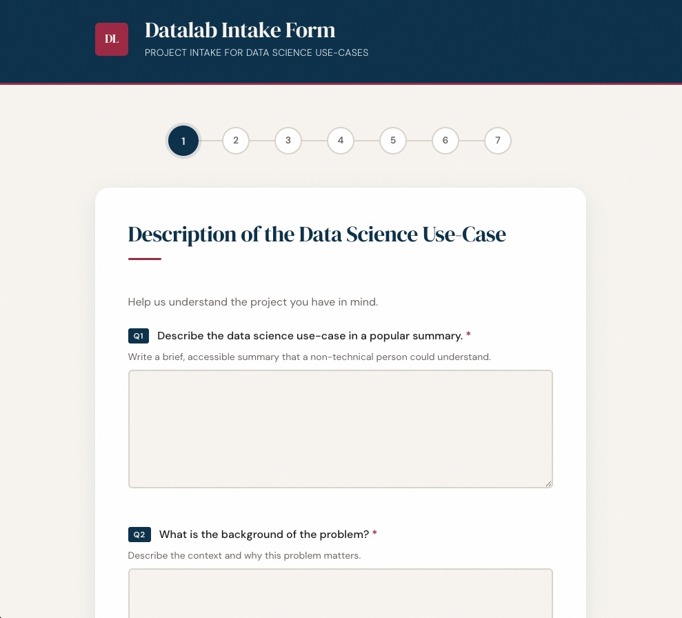

# AI SusTech Datalab Intake Form

A config-driven, multi-step intake form for the AI SusTech Datalab. Collects data & AI project requests through a guided questionnaire and exports the results as Markdown or CSV.

No database, no backend — just static HTML/CSS/JS served via Docker.



## Quick Start

### Using Docker (recommended)

```bash
docker compose up --build
```

Open [http://localhost:8080](http://localhost:8080) in your browser.

To stop:

```bash
docker compose down
```

### Without Docker

Serve the `src/` directory with any static file server:

```bash
npx serve src -l 8080
```

## How It Works

1. A **landing page** introduces the form with an overview of the sections and estimated time
2. The user navigates through 6 question pages covering use-case, regulations, data, and tech stack
3. The **summary page** shows all answers with "Edit" links to jump back to any section
4. Download the completed intake as **Markdown** or **CSV**
5. A **Start Over** button clears all answers to begin fresh
6. Form state is persisted in `sessionStorage` — refreshing the page won't lose data
7. Browser **back/forward buttons** work — each page gets a readable URL hash (e.g. `#use-case-description`)

## Download Formats

### Markdown

The downloaded file (`aisustech-datalab-intake-YYYY-MM-DD.md`) is a structured document:

```markdown
# AI SusTech Datalab Intake Form

> Project intake for data & AI projects

**Generated:** 2026-03-31

---

## 1. Description of the Use-Case

*Help us understand the project you have in mind.*

### Q1: Describe the use-case in a popular summary.

*Write a brief, accessible summary that a non-technical person could understand.*

We want to predict patient readmission rates using historical hospital data
to improve discharge planning and reduce unnecessary readmissions.

---

## 2. Management and Regulations

### Q5: Is there Medical Ethics Review Committee (METC) approval?

Yes

---
...
```

### CSV

The CSV export produces a spreadsheet-friendly file with columns:

| Section | Question ID | Question | Answer |
|---|---|---|---|
| Description of the Use-Case | Q1 | Describe the use-case... | We want to predict... |
| Management and Regulations | Q5 | Is there METC approval? | Yes |

CSV fields are escaped to prevent Excel formula injection.

### Filename

Configurable via `downloadFilenamePrefix` in `formConfig.json`:

```
{prefix}-YYYY-MM-DD.md
{prefix}-YYYY-MM-DD.csv
```

Default: `aisustech-datalab-intake-2026-03-31.md`

## Configuring the Form

All form content lives in a single JSON file:

```
src/config/formConfig.json
```

Edit this file to add, remove, or change questions. No other file needs to change. Since it's plain JSON (not JavaScript), non-developers can safely edit it too.

### Config Structure

```json
{
  "title": "AI SusTech Datalab Intake Form",
  "subtitle": "Project intake for data & AI projects",
  "downloadFilenamePrefix": "aisustech-datalab-intake",
  "nextButtonText": "Next",
  "prevButtonText": "Previous",

  "pages": [
    {
      "id": "landing",
      "isLanding": true,
      "title": "Welcome to the AI SusTech Datalab",
      "subtitle": "Tell us about your data project",
      "description": "This form helps us understand your project needs...",
      "features": [
        { "icon": "01", "title": "Project Description", "text": "Describe your problem" }
      ],
      "startButtonText": "Start the Intake Form",
      "estimatedTime": "5–10 minutes",
      "fields": []
    },
    {
      "id": "my-page",
      "title": "Page Heading",
      "subtitle": "Optional description text",
      "fields": [ ]
    },
    {
      "id": "summary",
      "title": "Summary & Download",
      "isSummary": true,
      "summaryPageTitle": "Review Your Answers",
      "editButtonText": "Edit",
      "emptyFieldText": "No answer provided",
      "downloadInstructions": "Review your answers above, then download...",
      "downloadButtonText": "Download as Markdown",
      "startOverButtonText": "Start Over",
      "fields": []
    }
  ]
}
```

### Page Types

| Type | Property | Description |
|---|---|---|
| **Landing** | `"isLanding": true` | Welcome page with description, feature cards, and CTA button. Must be the first page. |
| **Form** | (default) | Question page with fields. Requires validation before advancing. |
| **Summary** | `"isSummary": true` | Read-only review with download buttons and Start Over. Must be the last page. |

### Field Types

#### `textarea` — Multi-line text input

```json
{
  "id": "background",
  "type": "textarea",
  "label": "What is the background of the problem?",
  "subtitle": "Describe the context and why this matters.",
  "placeholder": "Enter your answer...",
  "required": true,
  "rows": 5
}
```

#### `text` — Single-line text input

```json
{
  "id": "file-format",
  "type": "text",
  "label": "What is the file format?",
  "subtitle": "Specify file extensions you expect.",
  "placeholder": "e.g. .csv, .wav, .json",
  "required": true
}
```

#### `radio` — Single-select (pick one)

```json
{
  "id": "data-collected",
  "type": "radio",
  "label": "Is the data already collected?",
  "options": ["Yes, already collected", "No, still needs to be collected"],
  "required": true
}
```

#### `checkbox` — Multi-select (pick many)

```json
{
  "id": "stack-elements",
  "type": "checkbox",
  "label": "Which stack elements are needed?",
  "subtitle": "Select all that apply.",
  "options": ["Data collection", "Cleaning", "Analysis", "Visualization", "ML/AI", "Deployment"],
  "required": true
}
```

#### `select` — Dropdown menu

```json
{
  "id": "priority",
  "type": "select",
  "label": "What is the project priority?",
  "placeholder": "Choose a priority...",
  "options": ["Low", "Medium", "High", "Critical"],
  "required": true
}
```

### Optional Field Properties

| Property | Applies to | Description |
|---|---|---|
| `subtitle` | All types | Help text shown below the question label |
| `placeholder` | text, textarea, select | Placeholder text inside the input |
| `required` | All types | If `true`, the user must answer before advancing |
| `rows` | textarea | Number of visible rows (default: 4) |
| `infoLink` | All types | External reference link `{ "url": "...", "text": "..." }` |

### Landing Page Features

The landing page `features` array renders as cards in a 2x2 grid:

```json
"features": [
  { "icon": "01", "title": "Project Description", "text": "Describe your data problem" },
  { "icon": "02", "title": "Regulations", "text": "METC, GDPR, NDA requirements" }
]
```

### Examples

#### Adding a new page

Add a new object to the `pages` array (between form pages and the summary page):

```json
{
  "id": "team-info",
  "title": "Team Information",
  "subtitle": "Tell us about the people involved.",
  "fields": [
    {
      "id": "q13",
      "type": "text",
      "label": "Who is the project lead?",
      "placeholder": "Full name",
      "required": true
    },
    {
      "id": "q14",
      "type": "select",
      "label": "Which department?",
      "options": ["Research", "Engineering", "Clinical", "Operations", "Other"],
      "required": true
    }
  ]
}
```

#### Making a field optional

Simply omit `required` or set it to `false`:

```json
{
  "id": "notes",
  "type": "textarea",
  "label": "Any additional notes?",
  "subtitle": "Optional — add anything else we should know.",
  "rows": 4
}
```

## Development

### Prerequisites

- **Node.js** >= 18 (for linting tools)
- **Docker** (for local serving)

### Install dependencies

```bash
npm install
```

### Linting

```bash
npm run lint        # Run all linters (ESLint + Stylelint + HTMLHint)
npm run lint:js     # ESLint only
npm run lint:css    # Stylelint only
npm run lint:html   # HTMLHint only
npm run format      # Auto-format with Prettier
```

### NPM Scripts

| Script | Description |
|---|---|
| `npm run lint` | Run all linters |
| `npm run format` | Auto-format all source files |
| `npm run docker:up` | Start the Docker container |
| `npm run docker:down` | Stop the Docker container |

## Project Structure

```
src/
  index.html                        # Single-page HTML shell
  config/
    formConfig.json                  # All form content as JSON (edit this!)
  assets/
    favicon.svg                     # SVG favicon (AI monogram)
  css/
    reset.css                       # CSS reset
    variables.css                   # Design tokens (colors, fonts, spacing)
    layout.css                      # Page structure (header, main, footer)
    form.css                        # Form elements (inputs, radios, checkboxes, selects)
    navigation.css                  # Step indicator and nav buttons
    landing.css                     # Landing/welcome page
    summary.css                     # Summary/review page and download section
    utilities.css                   # Helpers (hidden, sr-only, reduced-motion)
  js/
    main.js                         # Entry point — loads config, wires DOM
    config/
      formConfig.js                 # Fetches and exposes the JSON config
    modules/
      formRenderer.js               # Reads config, builds DOM for each page
      landingRenderer.js            # Landing page with hero, features, CTA
      navigation.js                 # Page switching, step indicator, history API
      validation.js                 # Per-page required field checks
      stateManager.js               # In-memory + sessionStorage answer store
      markdownGenerator.js          # Converts answers to formatted Markdown
      csvGenerator.js               # Converts answers to CSV with formula protection
      downloadHandler.js            # Creates Blob and triggers file download
      summaryRenderer.js            # Review page with download + start over
      pageController.js             # Decoupled page navigation (avoids circular deps)
docker/
  Dockerfile                        # nginx:alpine — works standalone or with compose
  nginx.conf                        # Static file serving config
docker-compose.yml                  # Mounts src/ as volume on port 8080
```

## Architecture Decisions

- **Config-driven rendering** — All questions, options, labels, and UI text live in `formConfig.json`. The renderer reads this config and builds the DOM dynamically. Adding a question means editing one file.
- **No build step** — Uses native ES modules (`<script type="module">`). No bundler, no transpiler.
- **No database** — Form state lives in `sessionStorage` (survives page refresh, cleared when the tab closes). The deliverable is the downloaded file.
- **Browser history** — Each page pushes a readable hash to the URL (e.g. `#use-case-description`). Back/forward buttons work. Direct links to specific pages work.
- **Step validation** — Users can only navigate to pages they've already visited via the step indicator. The Next button validates required fields before advancing.
- **CSS custom properties** — All colors, fonts, and spacing are defined as variables in `variables.css`. Rebranding requires editing only that file.
- **Accessibility** — ARIA labels, `aria-describedby` on error fields, visually-hidden fieldset legends, `prefers-reduced-motion` support, keyboard-navigable step indicator.

## Theming

To change the visual appearance, edit `src/css/variables.css`:

```css
:root {
  --color-primary: #0a3049;       /* Header, buttons, active steps */
  --color-secondary: #9b2743;     /* Accent, info links, error states */
  --color-success: #5a8a3c;       /* Download button, completed steps */
  --color-bg: #f7f4ef;            /* Page background */
  --color-surface: #fff;          /* Card / form background */
  --font-display: 'DM Serif Display', georgia, serif;
  --font-body: 'DM Sans', system-ui, sans-serif;
}
```
